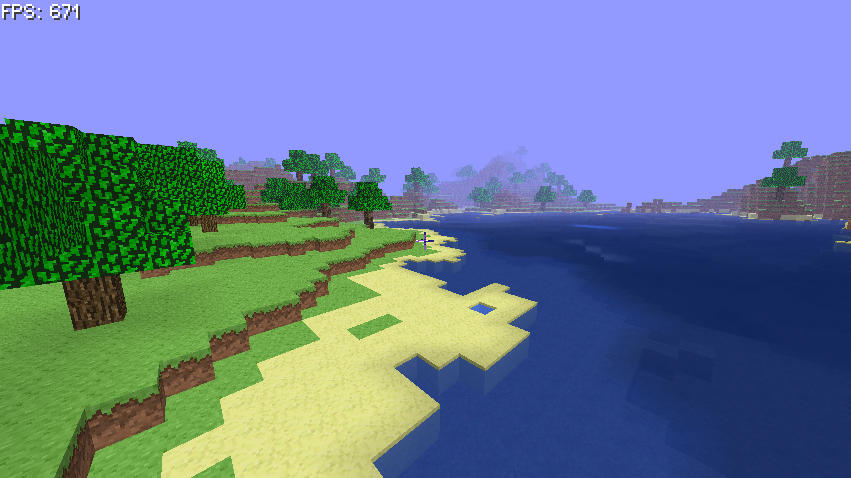
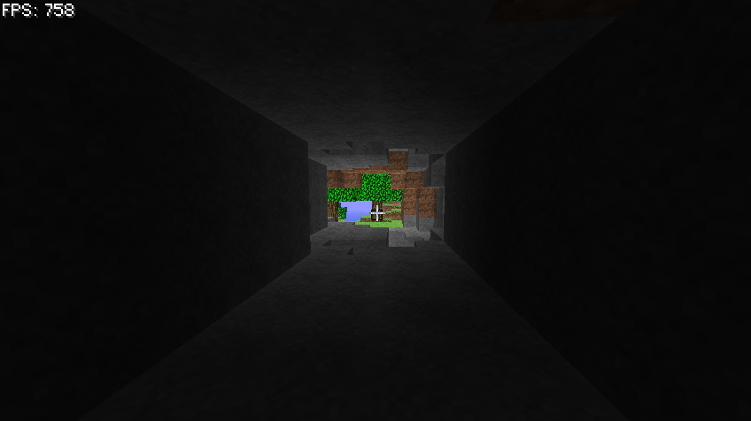

# Java 3D Game

#### Features
- Block rendering
- Block collision
- Player movement
    - Walking
    - Sprinting
    - Sneaking
    - Flying
    - Swimming
- Dynamic lightning
- Smooth lightning
- Anvil world loading/saving
- Perlin world generation
- Frustum Culling
- Fog
- Underwater fog
- HUD rendering
    - Cross-hair
    - Font rendering
- Dynamic FOV



#### Setup
- Clone the project
- Set your working directory to ``./run``
- Run main class ``de.labystudio.game.Game``
- Wait a few seconds for the world generation

#### Controls
```
W: Forward
S: Backwards
A: Left
D: Right

Left click: Destroy block
Right click: Place block
Middle click: Pick block

Space: Jump
Double Space: Toggle flying
Q: Sneaking
Shift: Sprinting
ESC: Toggle game focus

R: Return to spawn
```

#### Smooth lightning example


#### Known issues
- Mouse over block calculation is acting weird and doesn't work sometimes
- No light updates during world generation

#### Planned
- Generate new chunk if not generated yet (Infinite map)
- Multiplayer
- Entity rendering
- Loading screen